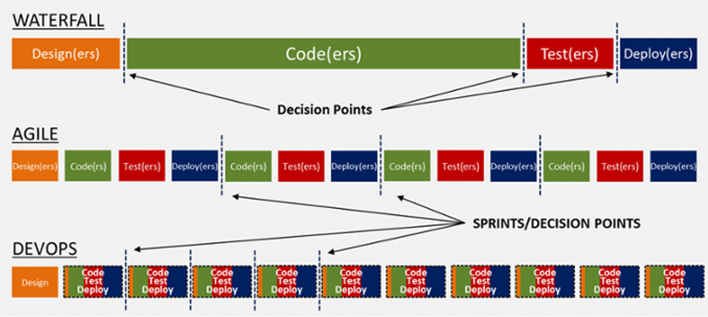

### **DevSecOps**

Now-a-day from the business perspective people like product owners are more concerned about the security flaws in web applications for business needs. Overthe last decade, the use of web applications increased exponentially high and attracts attackers as a glimpse to find out the vulnerabilities and explore the information which is the main resource for the business. Of these types of attacks for some reason, businesses may even collapse in exploring the core business resource (like the data, source code discourse, business logic, etc).

As a result, to prevent these types of vulnerabilities from finding after the application is deployed into production and running out of time to patch after the impact of an attack is high, businesses need to reach out to these vulnerabilities at the time of development of the application to make the application secure. But even further securing a web application is one of its kind where business is more concerned at the time of planning in SDLC (Software Development Life Cycle).

A more positive consequence is that the entity affected by a data breach focuses on improving security and recognizes software security as a business priority. Too often, until a breach occurs, security is an afterthought, the ‘poor relation’ in the Software Development Cycle. A central tenet of DevSecOps is that security is an integral and essential element of DevOps.

The major perspectives/areas on securing a web application starts with Code Analysis, Scanning the web application, Securing the Server, Securing the network, and Auditing the application according to compliance. Where it takes a lot of time and effort but in the business time to market is the main goal and major criteria. To withstand this DevSecOps will be a nice solution, it can reduce the costs associated with fixing security flaws, by building security into every stage of the development process, from the requirement stage onwards. Privacy and security principles should be integral to any company’s culture via DevSecOps best practices, and they should be endorsed at the board level. Security must be part of the application development process. DevSecOps makes everyone responsible for security.

### **Software Development Life Cycle (SDLC):**

Software Development Life Cycle (SDLC) is on quickly developing feature-rich, efficient, and productive applications. Where does security fit into this picture?

There are several traditional software development models that engineers utilize for developing software including, Waterfall, Agile, Scrum, and DevOps. Each of these models has various benefits and challenges.

The Waterfall model is a linear,
step-by-step, sequential development strategy with a top-down approach and
specific goals for each phase, allowing for easier management and
departmentalization.

In contrast, Agile is a more collaborative
model that has teams build modules in increments after a basic initial design
is determined. It’s then followed by evaluations and more module development.
Scrum is included in the Agile model.

DevOps seeks to create collaboration among IT silos so that QA teams, software developers, and operations admins/engineers work together throughout the SDLC.



Many IT firms do not have a large budget for security or don’t make it a priority.

Often times corporations take the approach of simply reacting to security vulnerabilities (as opposed to proactively testing for them) after the application has been developed and flaws have been found - either by personnel, researchers, end-users, or by hackers. For the former (personnel) - since testing usually occurs near the end of the SDLC - costs and timelines often do not allow businesses to go back and remediate the developed software.

### **Secure Software Development Life Cycle (Secure SDLC or SSDLC):**

Secure Software Development Life Cycle (Secure SDLC or SSDLC) incorporates security at every stage. This methodology also includes the use of secure coding techniques. Security is not just a goal, but a core concept that is implemented into the blueprint and architecture of the software at each step.

Adding Security into the SDLC is imperative as it includes small and important features in the software. It’s determined on a continuous and constant basis by collaborations between developers, operations admins, and security engineers.

**"TREATING SECURITY AS AN AFTERTHOUGHT IS LESS EFFICIENT AND MORE RISKY"**

By implementing and testing security throughout development, companies are able to allocate resources to future projects, rather than going back and fixing costly errors. Without security built-in from the project conception, there is a window of opportunity for cyber-criminals to breach an application's defenses.


SECURE SOFTWARE DEVELOPMENT LIFE CYCLE's goal is to help organizations integrate security into all phases of software development. We have to begin the Secure Development Life Cycle process by educating developers and executives, while also raising security awareness within organizations. We have to perform threat modeling, write security abuse cases, and conduct security tests during the requirements and planning phases. We have to utilize automated security scanners during the development and verification phases. We have to also build and utilize post-production security monitoring systems after release. By completing the feedback between development and operations, our work allows critical security information to become visible to everyone on the project team.

### **AIM OF THE POC:**

The purpose of this POC is to explain how to use the CI/CD tools(like Jenkins) to create a Fully automated functional pipeline starting from scratch. It mostly covers the Azure cloud resources which are used for the Deployment of a service, which is quite similar to the other cloud platforms as well and similar types of resources.

### **TOOLS & TECHNOLOGIES USED:**

- Jenkins(CI tool)
- GitHub(Private Repo for source code)
- Maven(to build and perform JUnit test)
- Azure Container Registry
- Azure Kubernetes Service
- SonarQube(for code analysis)
- JMeter(LSP testing)

### **Creating fully automated DevSecOps:**

The resources in the project are mostly from the Azure Cloud which gives you a detailed structure of the cloud as well. All the resources in the project are commercial and enterprise versions where you can also build with the open-source tools as well with slight changes in the code. To start your DevSecOps the initial step is to get a GitHub account which is used for Source Code Management(SCM). Whether be a public account for Academic project purposes or if you building for your project in your organization goes with a private account in Git Hub. In this scenario, it is a private account.

**Creating the Jenkins instance in the Azure cloud as follows**

Create an Azure account and go to create a resource in the search box Type Jenkins as shown below


where you can see the Jenkins as a service in Azure, click on create and configure accordingly for your requirement as follows


Once it's created it is as follows:


Connect to the VM by clicking on the Jenkins VM and select connect option in the menu bar and select to connect with the SSH access where it will show you the SSH command for connecting to the VM as follows:


get the command and run it via cmd prompt where it asks for the password which you have previously configured while cresting the VM should be provided as follows:


### **Binding Jenkins as a service to Public domain where everyone can access securely**

Click on the Jenkins VM which shows the properties of the VM

copy the DNS domain name which is given below:


<Specified name of reource>.westeurope.cloudapp.azure.com Go to **Continuous Deployment** resource group in specified subscription

create a DNS zone and select DNS zone resource as shown below:


click on add recordset as shown below:


and create the **CNAME** record set with Jenkins as shown below


**NOTE:** The above image shows "jenkins" in name field is only for example as the name "jenkins" is already configured.

and click on **OK**

and add the following text for the existing text contains in the default file:
```
server {

listen 443 ssl;
server_name <Domain name>;
ssl_certificate /etc/letsencrypt/live/<Domain name>/fullchain.pem;
ssl_certificate_key /etc/letsencrypt/live/<Domain name>/privkey.pem;
location / {
proxy_set_header Host $host:$server_port;
proxy_set_header X-Real-IP $remote_addr;
proxy_set_header X-Forwarded-For $proxy_add_x_forwarded_for;
proxy_set_header X-Forwarded-Proto $scheme;
# Fix the "It appears that your reverse proxy set up is broken" error.
proxy_pass http://localhost:8080;
proxy_read_timeout 90;
}

}
```
### **Installing and configuring Nginx for reverse proxy for port 80.**

Installation
on Nginx server by following commands
```
sudo apt update
sudo apt install nginx
sudo systemctl status nginx
```
if it is inactive (working fine)

if it is **inactive** (start the server by the following commands)
```
sudo systemctl start nginx
sudo systemctl restart nginx
```
Initially
run the Nginx server with default settings

once it's done go to the path by the following command:
```
sudo nano /etc/nginx/sites-available/default
```
and add the following text for the existing text contained in the default file

content in the default file

### **Installing and creating the SSL certificate using letsencrypt.**
```
sudo git clone https://github.com/letsencrypt/letsencrypt
cd letsencrypt/
./letsencrypt-auto certonly
sudo ./letsencrypt-auto certonly
sudo service nginx restart
sudo ./letsencrypt-auto certonly
```
```
sudo grep -r -P '[^\x00-\x7f]' /etc/nginx /etc/letsencrypt
```
and
remove the  # Fix the "It appears that your reverse proxy set up is broken" error.

and then re-run the **Nginx** server by the following command:
```
sudo systemctl start nginx
```
```
sudo systemctl restart nginx
```

***Configuring the public IP in Jenkins URL.***

go to manage Jenkins → configuration → Jenkins location and configure as shown below: 


configure Jenkins location in Jenkins

### **Automating Deployment through freestyle job**

As an initial step access the Jenkins server through  SSH as mentioned above and install the following:

#### Git
command:  ```sudo apt-get install git-core```

#### Maven
command:  ```sudo apt install maven```

#### Kube CTL
follow the steps provided in this [**link**](https://kubernetes.io/docs/tasks/tools/install-kubectl/#install-with-chocolatey-on-windows)

#### AZ CLI
follow the steps provided in this [**link**](https://docs.microsoft.com/en-us/cli/azure/install-azure-cli-windows?view=azure-cli-latest)

Once it's done access the Jenkins portal which you had configured before to make it public and set it up as follows to Automate deployment

Creating the job:

go to Jenkins and create a freestyle project

as shown below example:


Freestyle job in jenkins

once the job is created it will be as follows:


Job in Jenkins

### Git clone of the demo

**cloning the code from the code GIT hub should be configured as follows:**
At first, we should create the secrete from the git by the following URL:
https://github.com/settings/tokens 

and configure the GIT as follows:


Accessing the private GIT repository

place the following git URL

```https://github.com/<project name specified>.git```

in credentials select for the secrete 


Git token as secrete in Jenkins credentials

place the secrete from the git token should be paste here

and the **branches** to be built should be the master

in **additional behaviors** go to  check out to the sub-directory and select the directory to where it should be

**check out a subdirectory** and mention the path for the subdirectory

### Creating the build by using the Maven

please configure it as follows :


Build code for Jenkins which I had used for my job

where we can configure the *JAVA_HOME* and change the directory to a specific directory

and the script as follows:
```
#cd /GitWorkspaceDemo/ (if you are unable to define the path in git configuration)
#chmod +x mvnw (if maven wrapper doesn't have execute permissions)
#mvn -v(to check maven is installed and configured properly)
./mvnw package
```
### Creating the Image by using the JIB plugin and deploying it on the ACR(Azure Container Registry)

To create the image place the JIB plugin in the **pom.xml** file.

then run the following command after the Maven build.
```
mvn compile jib:build -Djib.to.image=<Image location path> -Djib.to.auth.username=<username of ACR> -Djib.to.auth.password=<Primary password generated by AKS>
```
where the above command is used to build the image and store it in the **Azure container registry.**

in  the command itself, we will mention where the image is used to store like the path of ACR, and specify the Image name as well by providing  the ACR credentials

### Deploying the Image from ACR to AKS(Azure Kubernetes Service)

where the Kube CTL installed system thereafter we have to do the AZ login

The following script should be placed in the executing
```
az aks get-credentials --resource-group <resource group> --name <resource name> --subscription <subscription name>
```
```
kubectl apply -f /home/pipeline/demo/demo-deployment.yaml
```
```
kubectl delete --all pods --namespace=default
```

### demo-deployment.yaml file contents as follows


demo deplyoment YAML file

### SonarQube Installation and configuration

Installation of SonarQube in windows:

→ First, download the SonarQube(LTS) from the [**link**](https://www.sonarqube.org/downloads/)

→ Download the Sonar Scanner from the [**link**](https://docs.sonarqube.org/display/SCAN/Analyzing+with+SonarQube+Scanner)

as shown below:


these files were used to download as ZIP as shown below.

extract them to C: drive

run the sonar server by going to the following path:

**C:\sonarqube-6.7.6\bin\windows-x86-64**


give the bin path of SonarQube and SonarScanner in the environment path variables

as shown below

open **cmd** over there as shown below:

and give the following command

```StartSonar.bat```


and click on enter then the sonar server starts running as shown below


after the sonarQube server is up on running go to the following link where sonarQube starts running in **9000** port

```http://localhost:9000```


the default username and password is **admin**

after login, configure what type of programming language and what type of build technologies we are using to generate the token 

in our case, it's **java** and **maven** and click on generate the token

as shown below:


generated token as shown below:


generating the command after specifying build technology;


run the following command in the specific directory for Demo and Router

**Demo:**
```
#cd <path>(if you want to define the path)
mvn sonar:sonar -Dsonar.host.url=http://localhost:9000 -Dsonar.login=<token generated>
```
After the code analysis by SonarQube go to projects there you can see as following:


If you want the code coverage please add the Jacoco plugin in **pom.xml** in DEMO

You have to add the same sonar code command in the Jenkins as a service(LINUX) in the Job build as shown below before building the code:


if everything is properly configured you can see as follows:


you can see the successful job as follows after you trigger the build

### configuring JMeter for Jenkins

create a .JMX file after configuring the required LSP test is configured

On the same path where the.JMX file is located run the following command
```
cd <apache JMeter path>/bin 
sh jmeter.sh -Jjmeter.save.saveservice.output_format=xml -n -t <path of JMeter JMX file>/<name of the JMeter JMX file>.jmx -l <result path>/TestResult.jtl 
```
So, this is how you can configure your own DevSecOps using **Jenkins, Maven**(for building and JUnit testing), **SonarQube**(code analysis), and **JMeter**(LSP testing).
You can also integrate web application scanners like **ZAP**(Zed attack proxy), **W3AF**, and **Arachini.**
which I had performed previously.

### Appendix:

**Video tutorials:**
- https://youtu.be/BuT1Ji0P9Ug
- https://www.youtube.com/watch?v=Wp6uS7CmivE&feature=youtu.be
- https://www.youtube.com/watch?v=mYGQPj78YhI

**Installing and configuring Apache Jmeter**
- https://www.guru99.com/guide-to-install-jmeter.html