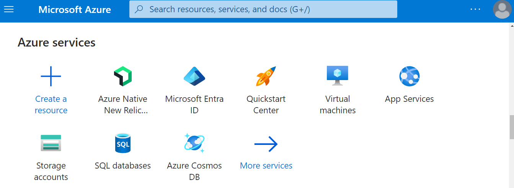
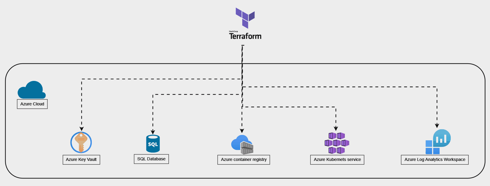
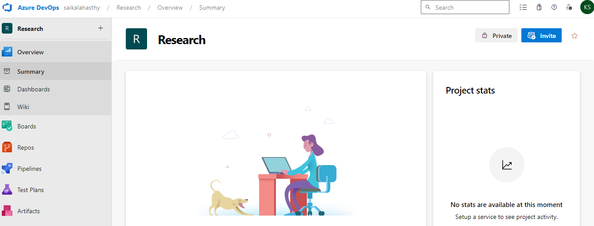
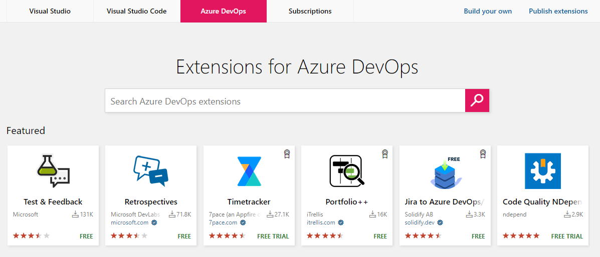
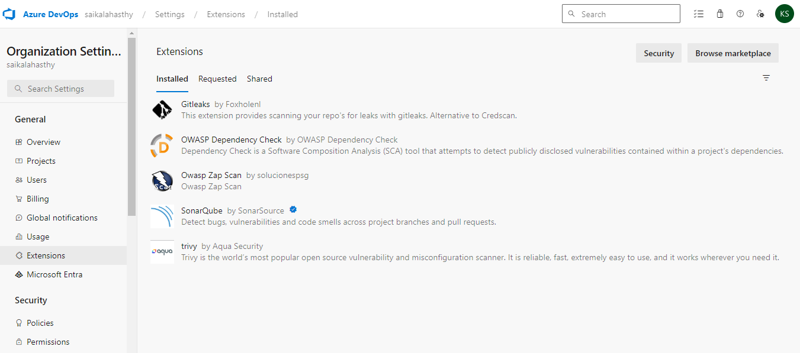
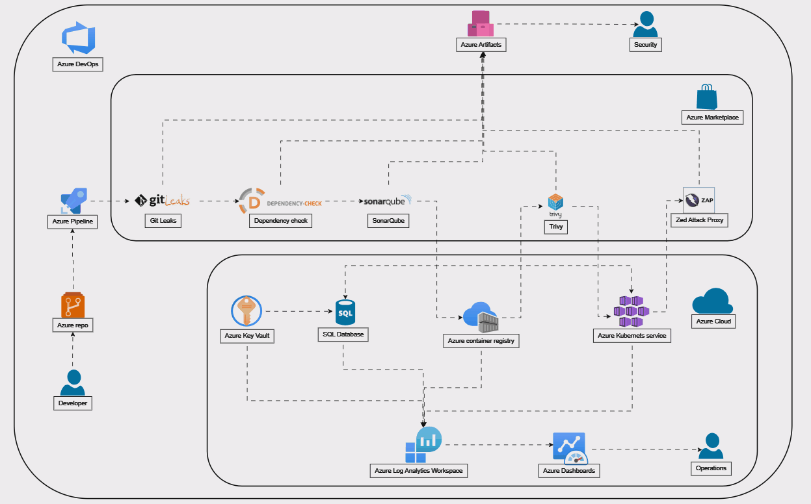

### **Azure DevSecOps**

In today's fast-paced software development landscape, ensuring security is paramount. Integrating security practices into the development process right from the start is crucial, and this is where DevSecOps comes into play. DevSecOps combines development, security, and operations to create a streamlined and secure software delivery pipeline.

In this guide, I will walk you through the step-by-step process of building a DevSecOps pipeline using Azure DevOps along with various Azure Marketplace tools such as Gitleaks, Dependency Check, SonarQube, Trivy, and ZAP.

### **Creat an Azure account**

Creating an Azure account involves several steps, including creating a Microsoft account, signing up for Azure, and providing necessary information for billing and verification. Here are the general steps to create an Azure account:

1) Create a Microsoft Account:

- If you already have a Microsoft account (e.g., Outlook, Hotmail, Xbox Live), you can skip this step.
- If not, go to the Microsoft account signup page: [Microsoft Account Signup](https://signup.live.com/)
- Follow the prompts to create a new Microsoft account by providing your email address, creating a password, and verifying your identity.

2) Sign up for Azure:

- Go to the Azure website: [Azure Sign-up Page](https://azure.microsoft.com/en-us/free/)
- Click on the "Start for free" or "Sign up" button.
- Sign in with your Microsoft account credentials if you're not already signed in.

3) Provide Personal Information:

- Fill out the required fields with your personal information, including name, country or region, email address, and phone number.

4) Verify Identity:

- Microsoft may require identity verification to ensure the security of your account. This verification process may involve receiving a verification code via email or phone call.

5) Enter Payment Information:

- To verify your identity and prevent misuse, you'll need to provide a valid credit card or debit card. No charges will be applied unless you upgrade your account and exceed the free usage limits.

6) Agree to Terms and Conditions:

- Read and accept the terms and conditions of using Azure.

7) Complete Sign-up:

- After providing all necessary information and agreeing to the terms, click on the "Sign up" or "Create Account" button to complete the process.

8) Access Azure Portal:

- Once your account is created, you can access the Azure portal using your Microsoft account credentials.
- The Azure portal is the web-based interface where you can manage your Azure resources, subscriptions, billing, and other settings.



{}
**Note:**
- Remember that Azure offers a free trial and various free services for new users. 
- Make sure to check the terms of the offer and any limitations associated with it. 
- Additionally, always monitor your usage to avoid unexpected charges.
{style="text-align: justify;"}
{}

**Azure Subscription ID:**

- The **Subscription ID** is a unique identifier assigned to an Azure subscription. An Azure subscription is essentially a billing unit that provides access to Azure services and resources.
- **Purpose:** It's used to identify and manage resources within a specific Azure subscription.
- **Example:** 12345678-1234-5678-abcd-1234567890ab

**Azure Tenant ID (also known as Directory ID or Directory Tenant ID):**

- The **Tenant ID** is a unique identifier for a specific Azure Active Directory (Azure AD) tenant. Azure AD is Microsoft's cloud-based identity and access management service.
- **Purpose:** It's used to identify the organization (tenant) that owns the Azure subscription and to manage access to Azure resources and applications.
- **Example:** 98765432-9876-5432-dcba-0987654321dc

| Differences | Subscription ID | Tenant ID |
| :----------------: | :------: | :----: |
| Scope        |   It's specific to an Azure subscription, which is a billing and management boundary.   | It's specific to an Azure AD tenant, which can encompass multiple subscriptions. |
| Usage        |   Used to manage resources within an Azure subscription, such as deploying resources, managing access, and monitoring usage and billing.   | Used for identity and access management, including user authentication, authorization, and role assignments across Azure services and applications within an organization. |
| Ownership    |  Owned by the account holder who has access to the Azure subscription.   | Represents the organization (tenant) and is owned by the organization's administrator. |
| Relationship |  Each Azure subscription is associated with one tenant (although a tenant can have multiple subscriptions).   | Represents the Azure AD directory under which the subscription (and associated resources) resides. |

**Azure Service Principal:**

A **service principal** in Azure is a security identity used by applications, services, and automation tools to access specific Azure resources. It's essentially a non-human identity (often referred to as a service account) that's typically used for programmatic access, rather than being tied to a specific user account.

1) **Purpose:** Service principals are created to grant applications and automation processes access to Azure resources. They are used for authentication and authorization, allowing these entities to interact with Azure APIs and perform actions on behalf of the associated application or service.

2) **Credentials:** Service principals are typically authenticated using a client ID and either a client secret (a password) or a certificate. These credentials are securely stored and used by the application or automation process to authenticate itself when accessing Azure resources.

3) **Granular Permissions:** Service principals can be assigned specific roles and permissions within Azure, allowing fine-grained control over what actions they can perform on resources. This helps enforce the principle of least privilege, ensuring that service principals only have access to the resources they need.

4) **Lifecycle Management:** Like other identities in Azure, service principals have a lifecycle that includes creation, assignment of permissions, and potential deletion or rotation of credentials. They can be managed programmatically using Azure SDKs, PowerShell, or Azure CLI, as well as through the Azure portal.

5) **Use Cases:** Service principals are commonly used in scenarios such as automated deployments (e.g., with Azure DevOps), running scheduled tasks or scripts, accessing Azure resources from applications running in other clouds, and granting permissions to Azure Managed Identity-enabled resources.

### **Azure Services used in the project**
- Azure Resource Groups
- Azure Key Valut (AKV)
- Azure Container Registry (ACR)
- Azure Kubernetes Service (AKS)
- SQL database
- Azure log analytics
- Dashboards


### **Create Azure resources using Terraform**
To create Azure resource groups, Azure Container Registry, Azure Kubernetes Service (AKS), Azure Log Analytics Workspace, and Azure Dashboards using Terraform, you'll need to follow these steps:



1) **Install Terraform:** Ensure you have Terraform installed on your local machine. You can download it from the official website: [Terraform Downloads](https://developer.hashicorp.com/terraform/install).

2) **Set Up Azure Authentication:** Terraform needs to authenticate with Azure. You can do this by setting up a service principal and configuring the Azure CLI. Follow these steps:

- Install Azure CLI: You can install it from [here](https://docs.microsoft.com/en-us/cli/azure/install-azure-cli).

- Log in to Azure CLI and set the subscription you want to use:
```bash
az login
az account set --subscription "<Your Subscription Name or ID>"
```
- Create a service principal:
```bash
az ad sp create-for-rbac --role="Contributor" --name="MyTerraformApp"
```
- Note down the **appId**, **password**, and **tenant** values returned. These are your service principal credentials.

3) **Write Terraform Configuration Files:** Create a directory for your Terraform configuration and create .tf files for each component you want to create.

- **main.tf:** Main Terraform configuration file.
- **variables.tf:** Define variables here.
- **provider.tf:** Configure Azure provider.
- **resource_group.tf:** Define Azure Resource Group.
- **container_registry.tf:** Define Azure Container Registry.
- **aks.tf:** Define Azure Kubernetes Service.
- **log_analytics.tf:** Define Azure Log Analytics Workspace.

4) **Write Terraform Configuration:** Below is a sample configuration for each component. Make sure to replace placeholders like <...> with your actual values.

- **provider.tf:**
```bash
provider "azurerm" {
  features {}
  subscription_id = "<Your Subscription ID>"
  client_id       = "<Service Principal App ID>"
  client_secret   = "<Service Principal Password>"
  tenant_id       = "<Azure Tenant ID>"
}
```

- **resource_group.tf:**
```bash
resource "azurerm_resource_group" "research" {
  name     = "my-resource-group"
  location = "East US"
}
```

- **container_registry.tf:**
```bash
resource "azurerm_container_registry" "research" {
  name                     = "my-container-registry"
  resource_group_name      = azurerm_resource_group.research.name
  location                 = azurerm_resource_group.research.location
  sku                      = "Basic"
  admin_enabled            = true
}
```
- **aks.tf:**
```bash
resource "azurerm_kubernetes_cluster" "research" {
  name                = "my-aks-cluster"
  location            = azurerm_resource_group.research.location
  resource_group_name = azurerm_resource_group.research.name
  dns_prefix          = "myakscluster"
  agent_pool_profile {
    name            = "default"
    node_count      = 1
    vm_size         = "Standard_DS2_v2"
  }
  service_principal {
    client_id     = "<Service Principal App ID>"
    client_secret = "<Service Principal Password>"
  }
}
```

- **log_analytics.tf:**
```bash
resource "azurerm_log_analytics_workspace" "research" {
  name                = "my-log-analytics-workspace"
  location            = azurerm_resource_group.research.location
  resource_group_name = azurerm_resource_group.research.name
  sku                 = "PerGB2018"
}
```

{}
**Note:**
- Terraform does not have direct support for Azure Dashboards. 
- You may need to use the **Azure CLI** or **Azure Resource Manager (ARM)** templates to create dashboards programmatically. 

{}

5) **Initialize Terraform:** Run **terraform init** in your terminal within the directory containing your Terraform configuration files. This command initializes your Terraform environment and downloads necessary providers.

6) **Apply Terraform Configuration:** Run **terraform apply** and confirm the changes Terraform will make. If everything looks correct, confirm and Terraform will provision the Azure resources according to your configuration.

7) **Verify Resources:** After Terraform has applied the configuration, verify in the Azure portal that the resources have been created as expected.

By following these steps, you should be able to create Azure resource groups, Azure Container Registry, Azure Kubernetes Service, and Azure Log Analytics Workspace using Terraform. Make sure to adapt the configuration according to your specific requirements and best practices.

### **Azure DevOps**
Azure DevOps is a suite of cloud-based collaboration tools provided by Microsoft that helps software development teams to plan, develop, test, and deploy applications efficiently. It encompasses a range of services designed to support the entire DevOps lifecycle, from planning and coding to building, testing, and releasing software.



Key components of Azure DevOps include:

- **Azure Boards:** Agile planning tools for tracking work items, defining sprints, and managing backlogs using Kanban boards or Agile dashboards. It enables teams to plan, track, and discuss work across the entire development lifecycle.

- **Azure Repos:** Git repositories for version control, allowing teams to securely store and manage their source code. It supports both centralized and distributed version control workflows and integrates seamlessly with popular development tools and IDEs.

- **Azure Pipelines:** Continuous integration and continuous delivery (CI/CD) service for automating build, test, and deployment processes. It enables teams to create pipelines to automatically build, test, and deploy code to any platform or cloud with high reliability and flexibility.

- **Azure Test Plans:** Test management tools for creating, executing, and tracking manual and exploratory tests. It provides comprehensive testing capabilities, including test case management, test execution, and defect tracking, to ensure the quality of software applications.

- **Azure Artifacts:** Package management service for storing and sharing packages, artifacts, and dependencies across development teams. It allows teams to create, publish, and consume packages from public and private repositories, improving code reuse and collaboration.

- **Azure DevOps CLI:** Command-line interface for interacting with Azure DevOps services and automating tasks from the command line or scripts.


### **Setting up Azure DevOps**

1) Create an Azure DevOps Account: If you don't already have one, sign up for an [Azure DevOps account](https://azure.microsoft.com/en-us/products/devops/).

2) Create a New Project: In Azure DevOps, create a new project where you'll be setting up your DevSecOps pipeline.

### **Configure Version Control**

1) Initialize Azure Repository: Initialize a Azure repository within your Azure DevOps project to manage your source code.

2) Add Collaborators: Invite team members who will be working on the project to collaborate on the Git repository.


### **Set up Azure DevOps Pipeline**

1) Create Pipeline: Navigate to your Azure DevOps project, and create a new pipeline to automate the CI/CD process.

2) Configure Pipeline Stages: Define stages for building, testing, and deploying your application.

### **Azure Marketplace**
The Azure Marketplace is an online store provided by Microsoft Azure that offers a wide range of cloud solutions and services built by Microsoft, third-party vendors, independent software vendors (ISVs), and open-source developers. It serves as a platform where Azure users can discover, purchase, deploy, and manage applications and services directly within their Azure environment.



Here are some key aspects of the Azure Marketplace:

1) **Rich Catalog of Solutions:** The Azure Marketplace offers thousands of pre-configured applications, virtual machine images, software solutions, development tools, templates, and data services across various categories such as AI & machine learning, databases, networking, security, storage, developer tools, and more.

2) **Third-Party Offerings:** In addition to Microsoft's own offerings, the Marketplace includes solutions from a diverse range of third-party vendors and partners. These can range from popular software applications to specialized industry solutions.

3) **Easy Deployment:** Users can easily deploy solutions from the Azure Marketplace directly into their Azure environment with just a few clicks. This streamlined deployment process helps users quickly provision and configure resources without the need for extensive manual setup.

4) **Flexible Pricing Models:** Azure Marketplace offerings may have different pricing models, including pay-as-you-go, bring-your-own-license (BYOL), free trials, and subscription-based plans. Users can choose the pricing model that best fits their needs and budget.

5) **Integration with Azure Services:** Many solutions available in the Azure Marketplace are tightly integrated with Azure services, enabling seamless interoperability and enhanced functionality. This integration often simplifies tasks such as data migration, application development, and management.

6) **Certified and Secure:** Microsoft ensures that solutions listed in the Azure Marketplace meet certain standards for security, compliance, and performance. Many offerings undergo certification processes to validate their compatibility and reliability on the Azure platform.

7) **Community Contributions:** The Azure Marketplace also welcomes contributions from the community, allowing developers and ISVs to publish their own solutions and reach a broader audience of Azure users.

Overall, the Azure Marketplace serves as a convenient and centralized platform for discovering, acquiring, and deploying a wide range of cloud solutions, empowering organizations to innovate, scale, and optimize their Azure deployments with ease.

### **Security Tools Used**

- **Gitleaks:** Add Gitleaks to your pipeline to scan your Git repository for sensitive information leaks.

- **Dependency Check:** Incorporate Dependency Check to analyze your application's dependencies for known vulnerabilities.

- **SonarQube:** Integrate SonarQube for static code analysis to identify and fix code quality and security issues.

- **Trivy:** Add Trivy to scan your container images for vulnerabilities during the CI/CD process.

- **ZAP:** Incorporate ZAP (OWASP Zed Attack Proxy) to perform dynamic application security testing (DAST) on your application.



### **Integrating Security Tools**

To set up an Azure DevOps pipeline with the specified stages, follow these steps:

1) **Precommit Hooks using GitLeaks:**
First, you need to set up precommit hooks using GitLeaks. GitLeaks scans your Git repository for sensitive data such as API keys and credentials before committing. You'll typically set up Git hooks locally on each developer's machine rather than within the pipeline itself. 

   Here's a brief overview:

- Install GitLeaks on your local development machine following the instructions provided on the GitLeaks GitHub page.
- Set up a precommit hook in your Git repository to run GitLeaks before allowing commits. This process usually involves adding a script or configuration file to your repository's .git directory.

2) **Software Composition Analysis (SCA) using Dependency Check:**

   To integrate Dependency Check for SCA into your Azure DevOps pipeline:

- Install the Dependency Check extension from the Azure DevOps Marketplace.
- Add a Dependency Check task to your pipeline YAML file or configure it using the Azure DevOps visual interface.
- Configure the task to run Dependency Check tests on your project's dependencies.

3) **Static Analysis Security Testing (SAST) using SonarQube:**

   To set up SAST using SonarQube:

- Install SonarQube on a server or use SonarCloud for cloud-based analysis.
- Add SonarQube analysis to your pipeline YAML file or configure it using the Azure DevOps visual interface.
- Configure the SonarQube task to analyze your project's source code and report any security vulnerabilities or code quality issues.

4) **Dynamic Application Security Testing (DAST) using OWASP ZAP:**

   To integrate OWASP ZAP for DAST:

- Download and install OWASP ZAP on a server accessible or Install OWASP ZAP extension from the Azure DevOps Marketplace to your pipeline.
- Add OWASP ZAP tasks to your pipeline YAML file or configure them using the Azure DevOps visual interface.
- Configure the tasks to run ZAP scans against your application endpoints and report any vulnerabilities found.

5) **Container Security (CS) using Trivy:**

   To set up container security scanning using Trivy:

- Install Trivy on a server or use a containerized version.
- Add Trivy tasks to your pipeline YAML file or configure them using the Azure DevOps visual interface.
- Configure the tasks to scan your container images for vulnerabilities and report the results.

6) **Pipeline Configuration:**

- Define stages in your pipeline YAML file or through the Azure DevOps visual interface.
- Configure dependencies between stages to ensure they run in the correct order.
- Specify any required environment variables, triggers, or conditions for each stage.

7) **Trigger Pipeline Execution:**

- Set up triggers to automatically run the pipeline on code commits or pull requests.
- Optionally, trigger the pipeline manually as needed.

Below is an example YAML pipeline configuration that includes stages for pre-committed hooks, software composition analysis, static analysis security testing, dynamic application security testing, and container security:

```YAML
trigger:
- main  # Specify the branch to trigger the pipeline

stages:
- stage: PrecommitHooks
  displayName: 'Pre-committed Hooks'
  jobs:
  - job: PrecommitHooksJob
    pool:
      vmImage: 'ubuntu-latest'  # Choose an appropriate VM image
    steps:
    - script: |
        # Execute pre-committed hooks here using 'git leaks' or any other tool
        # Example: git leaks --verbose
      displayName: 'Execute pre-committed hooks'
    # Add more steps as needed

- stage: SCA
  displayName: 'Software Composition Analysis'
  jobs:
  - job: SCAJob
    pool:
      vmImage: 'ubuntu-latest'
    steps:
    - task: DependencyCheckScan@1
      inputs:
        # Configure Dependency CheckScan task inputs as per your requirements
      displayName: 'Run Dependency Check Software Composition Analysis'

- stage: SAST
  displayName: 'Static Analysis Security Testing'
  jobs:
  - job: SASTJob
    pool:
      vmImage: 'ubuntu-latest'
    steps:
    - task: SonarQubePrepare@4
      inputs:
        # Configure SonarQubePrepare task inputs as per your SonarQube server details
      displayName: 'Prepare SonarQube analysis'
    - task: SonarQubeAnalyze@4
      displayName: 'Run SonarQube analysis'
    - task: SonarQubePublish@4
      inputs:
        # Configure SonarQubePublish task inputs as per your SonarQube server details
      displayName: 'Publish SonarQube analysis results'

- stage: DAST
  displayName: 'Dynamic Application Security Testing'
  jobs:
  - job: DASTJob
    pool:
      vmImage: 'ubuntu-latest'
    steps:
    - task: ZAPScan@1
      inputs:
        # Configure ZAPScan task inputs as per your ZAP configuration
      displayName: 'Run ZAP Dynamic Application Security Testing'

- stage: ContainerSecurity
  displayName: 'Container Security'
  jobs:
  - job: ContainerSecurityJob
    pool:
      vmImage: 'ubuntu-latest'
    steps:
    - script: |
        # Execute Trivy for container security scanning
        # Example: trivy image <image-name>
      displayName: 'Run Trivy Container Security Scan'
```



8) Monitoring and Notifications:

- Set up monitoring to track pipeline execution and performance.
- Configure notifications to alert stakeholders of pipeline failures or security issues.
- By following these steps, you can set up an Azure DevOps pipeline with precommitted hooks, SCA using Dependency Check, SAST using SonarQube, DAST using OWASP ZAP, and container security using Trivy.

### **Review and Optimize**
**Test Pipeline:** Run your pipeline to ensure all stages are executed correctly and security tools are integrated seamlessly.

**Monitor and Optimize:** Continuously monitor your pipeline's performance and security scans. Optimize as needed to improve efficiency and security.

By following these steps, you'll have a robust DevSecOps pipeline in place, leveraging Azure DevOps and a suite of security tools from Azure Marketplace to deliver secure and reliable software continuously. Remember, security is not a one-time task but an ongoing process, so make sure to keep updating and refining your pipeline to stay ahead of potential threats.