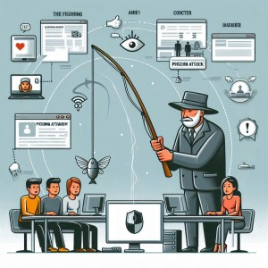
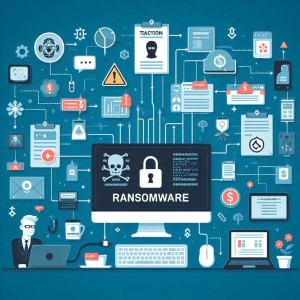
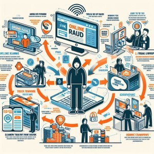
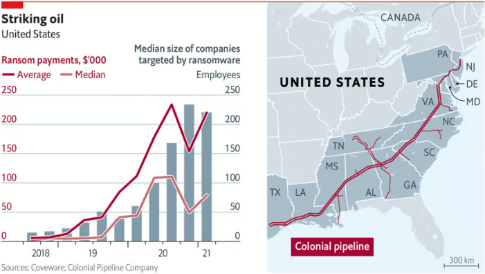
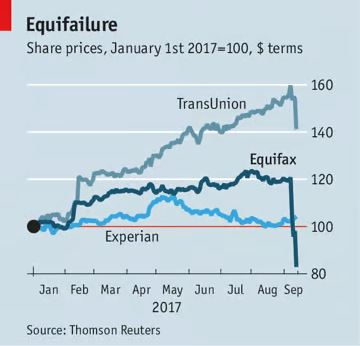
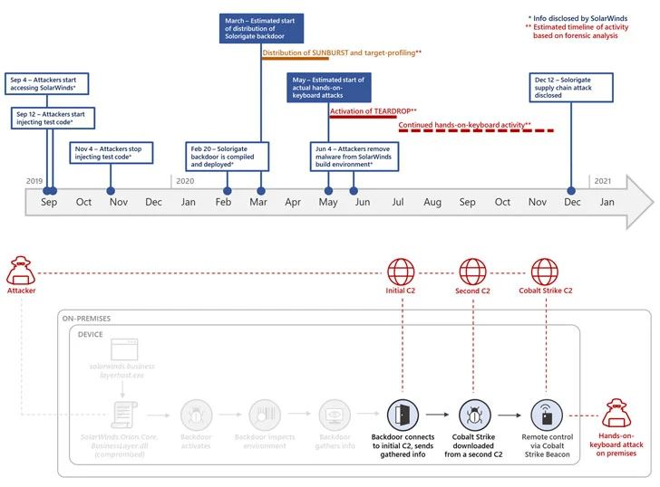

### **Introduction: The Rise of Cybercrime and Its Impact on Daily Life**

In today's digital age, the rise of cybercrime has become one of the most pressing challenges for individuals and organizations alike. With the increasing reliance on technology for communication, financial transactions, and data storage, cybercriminals have found more opportunities to exploit vulnerabilities. Cybercrime includes a wide range of malicious activities such as phishing, ransomware attacks, identity theft, and data breaches, all of which can have devastating effects on victims.
{style="text-align: justify;"}

The impact of cybercrime on daily life is profound. Individuals may face financial loss, compromised personal information, and emotional distress. Businesses, on the other hand, can suffer from operational disruptions, reputational damage, and significant financial costs due to data breaches and cyber-attacks. As these incidents become more frequent and sophisticated, the need for heightened awareness and proactive measures has never been more critical.
{style="text-align: justify;"}

### **The Importance of Awareness and Proactive Measures**

Raising awareness about cybercrime is essential in empowering individuals and organizations to protect themselves. By understanding the various types of cyber threats and the tactics used by cybercriminals, people can better recognize potential dangers and respond appropriately. Proactive measures, such as using strong, unique passwords, enabling two-factor authentication, and keeping software up to date, are vital in creating a robust defense against cyber-attacks.
{style="text-align: justify;"}

Moreover, fostering a culture of cybersecurity awareness encourages continuous education and vigilance, reducing the risk of falling victim to cybercrime. As technology continues to evolve, so do the methods used by cybercriminals, making it imperative for everyone to stay informed and proactive in safeguarding their digital lives.
{style="text-align: justify;"}

### **What is Cybercrime?**

Cybercrime refers to illegal activities that are conducted using computers and the internet. These crimes can target individuals, businesses, governments, and other entities, and they can range from stealing personal information to disrupting entire networks. Cybercriminals exploit vulnerabilities in software, systems, and human behavior to carry out their malicious activities, often for financial gain, but sometimes for political or social motives.
{style="text-align: justify;"}

### Types of Cybercrime

**Phishing**

Phishing involves cybercriminals attempting to obtain sensitive information such as usernames, passwords, and credit card details by disguising themselves as trustworthy entities in electronic communications. Typically, phishing attacks come in the form of fraudulent emails or messages that appear to be from legitimate sources like banks, social networks, or online services. The aim is to trick the recipient into clicking on a malicious link or providing confidential information.
{style="text-align: justify;"}

*Example:* An email that looks like it's from your bank, asking you to verify your account details by clicking on a link and entering your password.

**Ransomware**

Ransomware is a type of malicious software designed to block access to a computer system or encrypt its data until a ransom is paid. Once the ransomware infects a system, it typically displays a message demanding payment to restore access. Even if the ransom is paid, there is no guarantee that the cybercriminals will restore access to the data.
{style="text-align: justify;"}

*Example:* The WannaCry ransomware attack in 2017, which affected hundreds of thousands of computers worldwide and demanded payments in Bitcoin to decrypt files.

**Identity Theft**

Identity theft occurs when someone illegally obtains and uses another person's personal information, such as Social Security numbers, credit card numbers, or bank account details, typically for financial gain. This type of cybercrime can result in significant financial losses and damage to the victim's credit history.
{style="text-align: justify;"}

*Example:* A cybercriminal steals your personal information and uses it to open credit card accounts in your name, leading to unauthorized charges and damaged credit.

**Data Breaches**

A data breach involves unauthorized access to confidential data, often stored by businesses or government entities. Cybercriminals infiltrate databases to steal sensitive information, such as customer records, employee details, and proprietary business data. These breaches can lead to identity theft, financial loss, and damage to a company's reputation.
{style="text-align: justify;"}

*Example:* The 2013 Target data breach, where the payment information of millions of customers was compromised.

**Distributed Denial of Service (DDoS) Attacks**

 Attacks")

A DDoS attack aims to make an online service unavailable by overwhelming it with a flood of internet traffic. Cybercriminals use multiple compromised systems to launch the attack, causing significant disruption to websites, online services, and networks.
{style="text-align: justify;"}

*Example:* A DDoS attack on a popular website, making it inaccessible to users for an extended period.

**Online Fraud**

Online fraud encompasses various schemes carried out over the internet to deceive individuals and organizations, often for financial gain. This includes auction fraud, investment fraud, and business email compromise (BEC).
{style="text-align: justify;"}

*Example:* A scammer posing as a company CEO sends an email to an employee in the finance department, instructing them to transfer funds to a fraudulent account.

### **The Impact of Cybercrime**

Cybercrime has significant and far-reaching effects on individuals, businesses, and society at large. Its consequences include financial losses, damage to reputation, disruption of services, and emotional distress. Here's a look at the impact of cybercrime with recent statistics and real-life examples to illustrate the severity of the issue.
{style="text-align: justify;"}

###  Recent Statistics on Cybercrime

**Financial Losses:** According to the FBI's Internet Crime Complaint Center (IC3), victims of cybercrime reported losses exceeding $4.2 billion in 2020 alone.

**Ransomware Costs:** The global cost of ransomware was estimated to be $20 billion in 2021, a significant increase from $11.5 billion in 2019, according to Cybersecurity Ventures.

**Data Breaches:** In 2023, the average cost of a data breach was $4.45 million, according to IBM's Cost of a Data Breach Report.

**Frequency of Attacks:** Cybersecurity company Symantec reported that there are more than 4,800 websites compromised with formjacking code every month.

**Identity Theft:** The FTC reported that in 2021, there were nearly 1.4 million reports of identity theft, an increase of 29% from the previous year.

### **Real-life Examples of Cybercrime Incidents**

**Colonial Pipeline Ransomware Attack (2021):**

**Incident:** The Colonial Pipeline, which supplies about 45% of the East Coast's fuel, was hit by a ransomware attack, forcing the company to shut down its operations.

**Impact:** This led to fuel shortages, price hikes, and widespread panic buying. The company paid a ransom of approximately $4.4 million in Bitcoin to the attackers.

**Equifax Data Breach (2017):**

**Incident:** Equifax, one of the largest credit reporting agencies, suffered a data breach that exposed the personal information of 147 million people.

**Impact:** The breach included sensitive data such as Social Security numbers, birth dates, addresses, and, in some cases, driver's license numbers. Equifax faced severe legal and financial repercussions, including a settlement of up to $700 million.
{style="text-align: justify;"}

**Twitter Hack (2020):**

**Incident:** High-profile Twitter accounts, including those of Barack Obama, Elon Musk, and Bill Gates, were hacked to promote a Bitcoin scam.

**Impact:** The scam resulted in over $100,000 being transferred to the hackers' accounts. The incident raised significant concerns about the security of social media platforms.

**Target Data Breach (2013):**

 source: slideshare credits: Abhilash vijayan")

**Incident:** Hackers gained access to Target's network through a third-party vendor, stealing credit and debit card information from approximately 40 million customers during the holiday shopping season.

**Impact:** Target faced financial losses, including settlement costs of $18.5 million, and suffered reputational damage, leading to a loss of customer trust.

**SolarWinds Cyberattack (2020):**

**Incident:** A sophisticated cyber-espionage campaign compromised the software company SolarWinds, affecting thousands of its clients, including multiple U.S. government agencies and numerous private sector organizations.

**Impact:** The attackers inserted malicious code into a SolarWinds software update, enabling them to spy on organizations and steal sensitive data over several months. The full extent of the damage is still being assessed, but it has been described as one of the most significant cyber-espionage efforts ever detected.

### **How to Protect Yourself from Cybercrime**

To safeguard yourself against cybercrime, it is essential to adopt a range of protective measures. Here are some practical steps you can take to enhance your cybersecurity:

1. **Use Strong, Unique Passwords**

**Create Complex Passwords:** Use a mix of letters (both uppercase and lowercase), numbers, and special characters. Avoid using easily guessable information such as birthdays or common words.
Unique Passwords for Each Account: Ensure that each of your online accounts has a unique password. This way, if one account is compromised, others remain secure.

**Password Managers:** Use a password manager to generate and store complex passwords securely. This tool can help you manage multiple passwords without needing to remember each one.

2. **Enable Two-Factor Authentication (2FA)**

**Add an Extra Layer of Security:** Two-factor authentication requires not only a password but also a second form of verification, such as a text message code or authentication app.

**Enable 2FA Where Possible:** Most major online services, including email providers, social media platforms, and financial institutions, offer 2FA. Enable it wherever it is available to protect your accounts.

3. **Be Cautious of Phishing Scams**

**Verify Email Sources:** Always check the sender's email address carefully. Phishing emails often come from addresses that look similar to legitimate ones but with slight alterations.

**Avoid Clicking on Suspicious Links:** Hover over links to see the URL before clicking. If the link looks suspicious or doesn’t match the expected destination, do not click on it.

**Look for Red Flags:** Phishing emails often contain spelling errors, urgent requests for personal information, or unexpected attachments. Be wary of any email that seems unusual.

4. **Keep Software and Systems Updated**

**Regular Updates:** Ensure your operating system, software, and applications are regularly updated. These updates often include security patches that fix vulnerabilities.

**Automatic Updates:** Enable automatic updates where possible to ensure you always have the latest security improvements.

5. **Use Reputable Security Software**

**Install Antivirus Software:** Use reputable antivirus and anti-malware software to protect your devices from malicious attacks. Ensure it is always up-to-date.

**Enable Firewalls:** Use firewalls to block unauthorized access to your computer and network.

**Regular Scans:** Perform regular scans of your devices to detect and remove any potential threats.

> Additional Tips

**Secure Your Wi-Fi Network:** Use a strong password for your Wi-Fi network and avoid using public Wi-Fi for sensitive transactions.

**Back Up Your Data:** Regularly back up important data to an external hard drive or cloud storage to prevent data loss in case of a cyber attack.

**Educate Yourself and Others:** Stay informed about the latest cybersecurity threats and best practices. Share this knowledge with family and friends to help them protect themselves as well.

{}
**Note:**
By implementing these cybersecurity measures, you can significantly reduce the risk of falling victim to cybercrime. Remember, cybersecurity is an ongoing process, and staying vigilant and informed is key to protecting your digital life.
{style="text-align: justify;"}
{}

### **Resources for Further Information**

To help you stay informed and better protect yourself against cybercrime, here are some valuable resources, including websites, hotlines, and tools dedicated to cybersecurity.

### Websites

**StaySafeOnline (National Cyber Security Alliance):**

**URL:** [staysafeonline.org](https://staysafeonline.org/)

**Description:** Provides comprehensive resources and tips for individuals and businesses on how to stay safe online.

**Cybersecurity & Infrastructure Security Agency (CISA):**

**URL:** [cisa.gov](https://www.cisa.gov/)

**Description:** Offers updates on the latest cybersecurity threats, alerts, and guidance for protecting critical infrastructure.

**Federal Trade Commission (FTC) - Identity Theft:**

**URL:** [identitytheft.gov](https://www.identitytheft.gov/)

**Description:** A one-stop resource for identity theft victims, including recovery plans and reporting tools.

**SANS Internet Storm Center:**

**URL:** [isc.sans.edu](https://isc.sans.edu/)

**Description:** Provides daily reports on the latest internet threats and vulnerabilities.

**Have I Been Pwned:**

**URL:** [haveibeenpwned.com](https://haveibeenpwned.com/)

**Description:** Allows users to check if their email addresses or phone numbers have been compromised in data breaches.

### Hotlines accross world

> **Federal Trade Commission (FTC) - Consumer Response Center:**

**Phone:** 1-877-FTC-HELP (1-877-382-4357)

**Description:** Provides assistance with consumer protection issues, including identity theft and fraud.

> **Internet Crime Complaint Center (IC3):**

**URL:** [ic3.gov](https://www.ic3.gov/)

**Description:** A division of the FBI where individuals and businesses can report cybercrime incidents.

> **Cybersecurity & Infrastructure Security Agency (CISA) - Cybersecurity Division:**

**Phone:** 1-888-282-0870

**Description:** Offers assistance and guidance on cybersecurity issues for both the public and private sectors.

### Hotlines in India for Cyber Crime

> **National Cyber Crime Reporting Portal**

**Phone:** 155260

**URL:** [cybercrime.gov.in](https://cybercrime.gov.in/)

**Description:** A government initiative to facilitate online reporting of cybercrime incidents, including cyber fraud, cyberbullying, and more. The portal provides a centralized mechanism to report complaints and track the status of the complaint.

### **Cyber Crime Cells in Major Cities**

> **Delhi:**

**Phone:** 011-23490010

**Address:** Cyber Crime Unit, Special Cell, Delhi Police, Lodhi Road, New Delhi.

> **Mumbai:**

**Phone:** 022-26569103

**Address:** Cyber Crime Investigation Cell, Bandra-Kurla Complex, Mumbai.

> **Bangalore:**

**Phone:** 080-22942236

**Address:** Cyber Crime Police Station, CID Headquarters, Carlton House, Palace Road, Bengaluru.

> **Chennai:**

**Phone:** 044-28512049

**Address:** Cyber Crime Cell, Office of the Commissioner of Police, Vepery, Chennai.

> **National Consumer Helpline (NCH)**

**Phone:** 1800-11-4000 or 14404

**URL:** [consumerhelpline.gov.in](https://consumerhelpline.gov.in/)

**Description:** Though primarily for consumer complaints, this helpline also assists with issues related to online shopping fraud and other cyber-related consumer grievances.

> **Cyber Crime Helpline (NASSCOM & DSCI Initiative)**

**Phone:** 1800-123-2830

**Description:** A helpline supported by the National Association of Software and Service Companies (NASSCOM) and Data Security Council of India (DSCI) to provide assistance on cybercrime issues.

###  Additional Resources

> **Indian Computer Emergency Response Team (CERT-In)**

**URL:** [cert-in.org.in](https://cert-in.org.in/)

**Description:** CERT-In is the national nodal agency for responding to computer security incidents as and when they occur. It provides alerts and advisories on cybersecurity threats.

> **Cyber Crime Cell Directory**

**URL:** [mha.gov.in](https://www.mha.gov.in/en)

**Description:** A downloadable PDF from the Ministry of Home Affairs, providing contact details for cybercrime cells across various states and Union Territories in India.

### **Tools**

> **Password Managers:**

**Examples:** [LastPass](https://www.lastpass.com/), [Dashlane](https://www.dashlane.com/), [1Password](https://1password.com/)

**Description:** These tools help create and store strong, unique passwords for all your online accounts securely.

> **Antivirus and Anti-Malware Software:**

**Examples:** [Norton](https://in.norton.com/), [McAfee](https://www.mcafee.com/en-in/index.html), [Bitdefender](https://www.bitdefender.com/), [Malwarebytes](https://www.malwarebytes.com/)

**Description:** Protects your devices from viruses, malware, and other cyber threats.

> **Two-Factor Authentication (2FA) Apps:**

**Examples:** [Google Authenticator](https://play.google.com/store/apps/details?id=com.google.android.apps.authenticator2&hl=en_IN), [Authy](https://authy.com/), [Microsoft Authenticator](https://www.microsoft.com/en-in/security/mobile-authenticator-app)

**Description:** Adds an extra layer of security to your online accounts by requiring a second form of verification.

> **Virtual Private Network (VPN) Services:**

**Examples:** [ExpressVPN](https://www.expressvpn.com/), [NordVPN](https://nordvpn.com/), [CyberGhost](https://www.cyberghostvpn.com/)

**Description:** Encrypts your internet connection and hides your IP address to protect your online privacy.

> **Firewall Software:**

**Examples:** [ZoneAlarm](https://www.zonealarm.com/), [Comodo Firewall](https://www.comodo.com/), [TinyWall](https://tinywall.pados.hu/)

**Description:** Helps prevent unauthorized access to your computer and network.

> **Backup Solutions:**

**Examples:** [Backblaze](https://www.backblaze.com/), [Carbonite](https://www.carbonite.com/), [Acronis](https://www.acronis.com/en-sg/)

**Description:** Regularly backs up your data to the cloud or external storage to protect against data loss.

### **Conclusion**

Cybercrime is a pervasive and growing threat in our increasingly digital world. It can have devastating effects on individuals, businesses, and society at large, ranging from financial losses and identity theft to significant operational disruptions and reputational damage. Understanding the different types of cybercrime, such as phishing, ransomware, and identity theft, is crucial for recognizing and mitigating potential threats.
{style="text-align: justify;"}

To protect yourself from cybercrime, it is essential to adopt robust cybersecurity practices:

- Use strong, unique passwords and consider using a password manager.
- Enable two-factor authentication (2FA) for an added layer of security.
- Be cautious of phishing scams by verifying email sources and avoiding suspicious links.
- Keep software and systems updated to protect against vulnerabilities.
- Use reputable security software to defend against viruses and malware.

**Additionally**, make use of the available resources for further information and assistance. Websites like StaySafeOnline, CISA, and the FTC provide valuable guidance, while hotlines in India, such as the National Cyber Crime Reporting Portal and local cybercrime cells, offer crucial support.
{style="text-align: justify;"}

> Encourage Proactive Steps

Staying informed about the latest cybersecurity threats and best practices is vital. Continuously educate yourself and others about the importance of cybersecurity. Implement the proactive measures discussed, and regularly review and update your security practices. By doing so, you can significantly reduce the risk of falling victim to cybercrime and contribute to a safer digital environment for everyone.
{style="text-align: justify;"}

{}
**Note:**
Remember, cybersecurity is an ongoing process, and vigilance is key. Take proactive steps today to protect yourself and stay ahead of cybercriminals.
{style="text-align: justify;"}
{}
