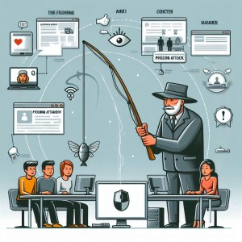

### Common Threats in Information Security: Insights from a Cyber Security Professional

In today's digitally-driven world, the importance of information security cannot be overstated. As a cyber security professional with six years of experience, I've seen firsthand the evolving landscape of cyber threats and the innovative tactics cybercriminals employ to exploit vulnerabilities. Understanding these threats is crucial for individuals and organizations to protect their sensitive information. In this blog, I'll discuss some of the most common threats in information security and provide insights on how to mitigate them.
{style="text-align: justify;"}

```markmap {height="300px"}
- Common Threats in Information Security
  - Phishing Attacks
  - Malware
  - Insider Threats
  - Distributed Denial of Service (DDoS) Attacks
  - SQL Injection
  - Man-in-the-Middle (MitM) Attacks
  - Zero-Day Exploits
```

1. **Phishing Attacks**



*Phishing* remains one of the most prevalent and effective methods for cybercriminals to steal sensitive information. These attacks typically involve fraudulent emails or messages that appear to come from legitimate sources, such as banks or well-known companies. The goal is to trick the recipient into clicking on malicious links or providing personal information.
{style="text-align: justify;"}

**How to Mitigate:**

- Educate employees and individuals about recognizing phishing attempts.
- Implement robust email filtering solutions.
- Encourage the use of multi-factor authentication (MFA) to add an extra layer of security.

2. **Malware**


*Malware*, or malicious software, includes viruses, worms, ransomware, and spyware. These programs are designed to disrupt, damage, or gain unauthorized access to computer systems. Ransomware, in particular, has become increasingly common, where attackers encrypt data and demand payment for its release.
{style="text-align: justify;"}

**How to Mitigate:**

- Install and regularly update antivirus and anti-malware software.
- Avoid downloading or installing software from untrusted sources.
- Keep all software and systems up to date with the latest security patches.

3. **Insider Threats**


*Insider threats* involve employees or contractors who intentionally or unintentionally cause harm to an organization. This could be through data theft, sabotage, or accidental disclosure of sensitive information. Insider threats are particularly challenging because they come from trusted individuals with legitimate access to systems and data.
{style="text-align: justify;"}

**How to Mitigate:**

- Conduct thorough background checks during the hiring process.
- Implement strict access controls and monitor user activity.
- Foster a culture of security awareness and encourage reporting of suspicious behavior.

4. **Distributed Denial of Service (DDoS) Attacks**

 Attacks")

*DDoS attacks* aim to overwhelm an organization's online services by flooding them with excessive traffic. This can cause websites, applications, or services to become slow or completely unavailable, leading to significant business disruption and financial loss.
{style="text-align: justify;"}

**How to Mitigate:**

- Use DDoS protection services to detect and mitigate attacks.
- Implement network redundancy and load balancing to distribute traffic.
- Regularly test and update incident response plans.

5. **SQL Injection**


*SQL injection* is a type of attack where cybercriminals exploit vulnerabilities in web applications to execute malicious SQL queries. This can result in unauthorized access to databases, allowing attackers to steal, modify, or delete sensitive data.
{style="text-align: justify;"}

**How to Mitigate:**

- Use parameterized queries and prepared statements to prevent SQL injection.
- Regularly test web applications for vulnerabilities.
- Implement web application firewalls (WAF) to filter and monitor traffic.

6. **Man-in-the-Middle (MitM) Attacks**

 Attacks")

In *MitM attacks*, cybercriminals intercept and manipulate communications between two parties without their knowledge. This can lead to data theft, eavesdropping, or even altering the communication content.
{style="text-align: justify;"}

**How to Mitigate:**

- Use strong encryption protocols for communications, such as TLS/SSL.
- Avoid using public Wi-Fi networks for sensitive transactions.
- Implement VPNs (Virtual Private Networks) for secure remote access.

7. **Zero-Day Exploits**


*Zero-day exploits* take advantage of unknown vulnerabilities in software or hardware. Since these vulnerabilities are not yet known to the software developers, there are no patches or fixes available, making zero-day attacks particularly dangerous.
{style="text-align: justify;"}

**How to Mitigate:**

- Employ advanced threat detection systems to identify unusual behavior.
- Regularly update and patch systems as soon as new updates are available.
- Collaborate with vendors and security communities to stay informed about potential threats.

### Conclusion

The cyber threat landscape is constantly evolving, and staying informed about common threats is essential for robust information security. By understanding these threats and implementing effective mitigation strategies, individuals and organizations can significantly reduce their risk of falling victim to cyber attacks. As a cyber security professional, I recommend ongoing education, proactive defense measures, and a culture of security awareness to safeguard your digital assets.
{style="text-align: justify;"}

**Stay safe and secure!**

Feel free to reach out if you have any questions or need further assistance in strengthening your information security posture. Together, we can build a safer digital world.

{}
**Note:**
This blog is for educational purpose only
{style="text-align: justify;"}
{}